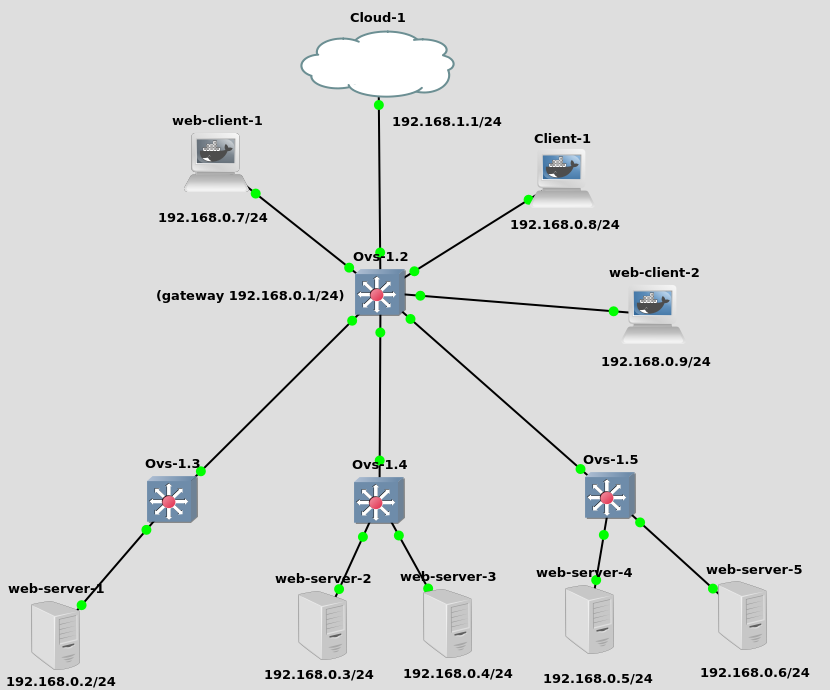

# Setup instructions for GNS3 emulator

## Goal
Setup GNS3 and Floodlight for testing the Virtual IP module.

## Prerequisites

We tested the setup on the "ANAWS" VirtualBox image provided during the course, 
which includes the following required components:
1. GNS3 version 2.1.11
2. Floodlight v1.2 (commit a6c11a)

In addition, you will need the contents of 
[this repository](https://github.com/Manciukic/dynamicserviceallocator), 
which includes:
1. Floodlight patch that adds the DynamicServiceAllocator module
2. Ready-to-use GNS3 project (optional)
3. OVS Docker image
4. Web server Docker image
5. Web client Docker image

## Setup instructions

### Floodlight
1. Merge the contents of the `floodlight` folder in the root of the repository 
with floodlights folder in your system.
```
$ rsync -av $REPO_ROOT/floodlight/ $FLOODLIGHT_ROOT/
```
2. Build and run Floodlight
```
$ cd $FLOODLIGHT_ROOT
$ ant run
```

### GNS3
Follow these instructions to setup GNS3 or use the provided ready-to-use project.
In any case, you need to build the provided Docker images.

#### Docker images
You need to build the following Docker images and import them in GNS:
1. `ovs_anaws`
2. `web-server`
3. `web-client`

In order to do so, for each image you need to:
1. Open terminal in its base directory, where `Dockerfile` is.
2. Build the image with the command `docker build . -t <folder_name>`
3. In GNS3, go to Edit > Preferences... > Docker > Docker Containers > New, 
    select the just build image and leave all other fields to their default
    to import the appliance (not required if using the ready-to-use project).

#### Network overview
We will setup two networks:
1. Management network (e.g. `192.168.1.0/24`): will connect Floodlight with all 
    OVS switches. A host tap interface will be placed on this network for 
    enabling connection with Floodlight. A loopback interface on each switch 
    will be placed in this network too.
2. Data network (e.g. `192.168.0.0/24`): will connect clients and servers. One 
    OVS switch will be the gateway, enabling connection from clients and servers
    to the Floodlight controller.



#### Manual setup
1. Create a new project
2. Create 4 OVS switches using the custom `ovs_anaws` appliance
3. Connect switch 1 to 2, 3 and 4 using any interface you like. Do not connect 
    switches 2, 3 and 4 together (leaf and spine topology).
4. Create a new Cloud and add `gns3-tap0` to the available interfaces. Connect switch 1 (spine switch)
   to this new interface on the Cloud.
   Tip: you may need to enable "Show special Ethernet interfaces".
5. Assign an IP on the management subnet (e.g. `192.168.1.1/24`) to the tap interface on the host:
```
ip link set gns3-tap0 up
ip addr add 192.168.1.1/24 dev gns3-tap0
```
6. Configure `LOOPBACK_ADDR` environment variable for the OVS switches. This address 
    needs to be in the management subnet (e.g. `192.168.1.0/24`).
    To do so, right-click on the switch, "Configure" and edit Environment variables field. E.g.:
```
LOOPBACK_ADDR=192.168.1.3/24
```

7.  Configure `IS_GATEWAY` environment variable only for OVS switch 1 (spine switch). This address
    needs to be in the data subnet (e.g. `192.168.0.0/24`).
    To do so, right-click on the switch, "Configure" and edit Environment variables field. E.g.:
```
LOOPBACK_ADDR=192.168.1.2/24
IS_GATEWAY=192.168.0.1/24
```    

8. Start the OVS switches.
9. Connect to the console of every OVS switch and configure the controller with 
    the command `ovs-vsctl set-controller br0 tcp:192.168.1.1:6653` (replace IP 
    address and port to Floodlight's). 
    Tip: you can check the controller connection status with the command
    `ovs-vsctl list controller`.
10. Create the client appliance by going to Edit>Preferences>Docker>Docker containers
    and creating a new appliance. Choose the Web client image and give it 1 adapter.
11. Create one or more clients using the custom `web-client` appliance and connect `eth0` to OVS switch 1.
12. Configure each client network with a static IP on the data subnet (e.g. `192.168.0.0/24`).

```
auto eth0
iface eth0 inet static
	address 192.168.0.2
	netmask 255.255.255.0
	gateway 192.168.0.1 #IS_GATEWAY on switch 1
```
13. Set the address given to `eth0` also to `IP_ADDR` environment variable on the same Web client. Set also
    `VIRTUAL_IP` environment variable to the IP address of the virtual web service (default `9.9.9.9`).
    Then, set also `CONTROLLER_ADDR` environment variable to host tap IP. E.g.:
    
```
VIRTUAL_IP=9.9.9.9
IP_ADDR=192.168.0.7
CONTROLLER_ADDR=192.168.1.1
```

14. Add route from host to data network by running the following command on the host 
    (replace the gateway IP with the spine switch loopback address):
```
ip route add 192.168.0.0/24 via 192.168.1.1
```

15. Repeat step 9 to 11 for the Web servers, but connect them to switch 2, 3 or 4 (any leaf switch).
    Also, statically set the MAC address for simplicity. E.g.:
E.g.:

```
auto eth0
iface eth0 inet static
	address 192.168.0.102
	netmask 255.255.255.0
	hwaddress ether 00:00:00:00:00:02
	gateway 192.168.0.1 #IS_GATEWAY on switch 1
```

16. Set the address given to `eth0` also to `IP_ADDR` environment variable as done with clients.
    Set also `MAC_ADDR` to the hardware address given to `eth0`. Set also `SERVICE_PORT` to 80. E.g.:

```
IP_ADDR=192.168.0.102
MAC_ADDR=00:00:00:00:00:02
SERVICE_PORT=80
```

#### Ready-to-use project
A ready-to-use GNS3 project implemented using the tutorial in the next section is provided 
in the local repository. To make it work, follow these simple steps:
 
1. Open the project with GNS3.
2. Run the following commands on the host running both GNS3 and Floodlight:
```
ip addr add 192.168.1.1/24 dev gns3-tap0
ip link set gns3-tap0 up
ip route add 192.168.0.0/24 via 192.168.1.1
```

## User manual
Web clients run a CLI which lets users subscribe and perform requests on the virtual service.
Here is shown the menu of this interface:

```
Welcome to the DSA client service. Here is a list of the available commands:

sub -> subscribe to the service
unsub -> unsubscribe from the service
get -> get the web page from the DSA server
quit -> quit this client
help -> to see this menu

To use the 'get' command, the user should first subscribe, otherwise the DSA will return an error message.
>_
```

Web servers are simple alpine containers running an apache httpd daemon. Since DSA supports also servers
subscriptions, their consoles come with `sub.sh` and `unsub.sh` commands to subscribe and unsubscribe
to the DSA servers pool.
